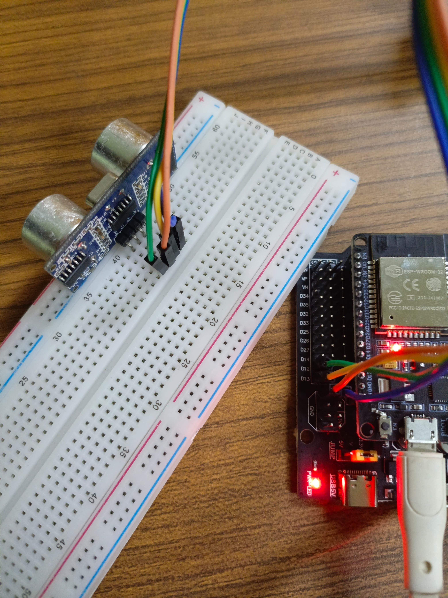

# ESP32-FLASK-LIGHT-SENSOR
Tugas Technical Assignments SIC 2024<br>
Disini saya menggunakan Sensor Ultrasonik sebagai Inputnya, Esp32 melakukan POST Data, dan Flask menampilkan data yang diterima ke Localhost.

# Identitas Diri
Nama :Muhammad Raihan Fadhilah<br>
Tim  : Enviromind<br>
Asal : MAN 2 Jakarta<br>

# Alat dan bahan
- ESP32
- Sensor Ultrasonik
- Kabel Jumper

# Pin ESP32 TO SENSOR
| Esp32 | Ultrasonic Sensor       |
|----------------|------------------|
| 5V / 3V| VCC |
| GND | GND |
| 13 | Trig |
| 12 | Echo |
# Foto Rangkaian Fisik


# Program Arduino IDE
```c++
#include <WiFi.h>
#include <HTTPClient.h>

// Ganti dengan SSID dan Password WiFi Anda
const char* ssid = "MAN 2 Jakarta";
const char* password = "alhamdulillah123";

int trig = 13;
int echo = 12;

// Ganti dengan URL server Flask Anda
const char* serverName = "http://192.168.9.63:5000/sensor";


void setup() {
  Serial.begin(115200);
  pinMode(trig, OUTPUT); // Pin sensor Trig
  pinMode(echo, INPUT); // Pin sensor echo
  WiFi.begin(ssid, password);

  while (WiFi.status() != WL_CONNECTED) {
    delay(1000);
    Serial.println("Connecting to WiFi...");
  }
  
  Serial.println("Connected to WiFi");
}

void loop() {
    digitalWrite(trig, LOW);
    delayMicroseconds(2);
    digitalWrite(trig, HIGH);
    delayMicroseconds(10);
    digitalWrite(trig, LOW);

    long duration = pulseIn(echo, HIGH);
    long distance = duration * 0.034 / 2;

    Serial.println(distance);
    if (WiFi.status() == WL_CONNECTED) {
      HTTPClient http;
      http.begin(serverName);
      http.addHeader("Content-Type", "application/x-www-form-urlencoded");

      String httpRequestData = "type=ultrasonik&value=" + String(distance);
      int httpResponseCode = http.POST(httpRequestData);

      if (httpResponseCode > 0) {
        String response = http.getString();
        Serial.println(httpResponseCode);
        Serial.println(response);
      } else {
        Serial.print("Error on sending POST: ");
        Serial.println(httpResponseCode);
      }

      http.end();
    } else {
      Serial.println("Error in WiFi connection");
    }
}
```
Klik tautan berikut untuk melihat kode <br>
[http_post.ino](http_post/http_post.ino)

# Program Python Flask
Program Flask
```python

from flask import Flask, request, render_template, jsonify

app = Flask(__name__)

valsen = {
    "sensor":{
        "light":{
            "value":0
        }
    }
}

@app.route('/sensor', methods=["POST","GET"])
def send_sensor():
    if request.method == "POST":
        tipe = request.form.get("type")
        if tipe == "light":
            valsen["sensor"]["light"]["value"] = int(request.form.get("value"))
        return jsonify(valsen)
    else:
        return jsonify(valsen)
    

@app.route('/', methods=["GET"])
def entry_point():
    return render_template("index.html")

if __name__ == '__main__':
    app.run(host="0.0.0.0",port=5000)
```
Atau bisa lihat pada link berikut : <br>
[myserver.py](myserver.py)

# Video Praktik
<video controls>
  <source src="video/Evideo.mp4" type="video/mp4"/>
</video>
Anda dapat men-download video demo di bawah ini

[video/video.mp4](video/video.mp4)


